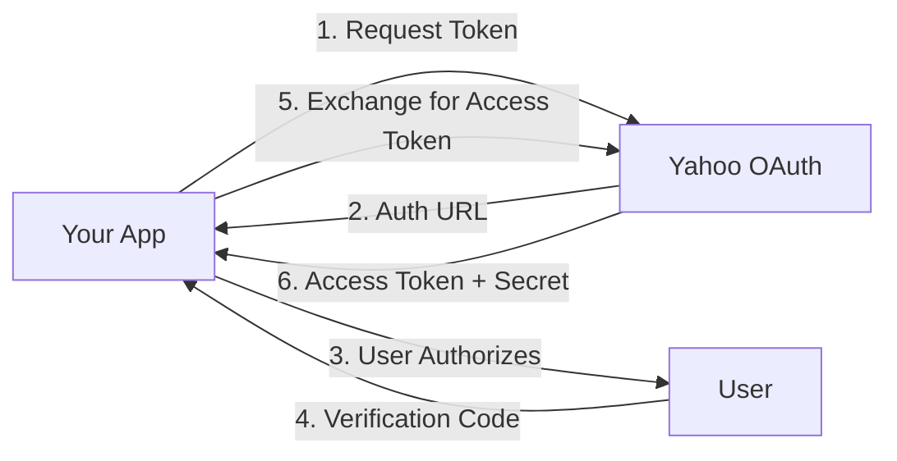

# Yahoo Fantasy MCP Server

A comprehensive Model Context Protocol (MCP) server providing full access to the Yahoo Fantasy Sports API. This server enables AI assistants and applications to interact with Yahoo Fantasy Football, Baseball, Basketball, and Hockey leagues through a well-typed, secure interface.

[](https://www.typescriptlang.org/)
[](https://modelcontextprotocol.io/)
[](LICENSE)

## 🌟 Features

- **100+ API Tools**: Complete coverage of Yahoo Fantasy Sports API
- **OAuth 1.0a Authentication**: Secure authentication with automatic token refresh
- **Full TypeScript Support**: Comprehensive type definitions for all endpoints
- **MCP Protocol Compliant**: Standard implementation for seamless AI assistant integration
- **Multi-Sport Support**: NFL, MLB, NBA, and NHL fantasy leagues
- **Transaction Management**: Add/drop players, trades, waivers, and FAAB bidding
- **Commissioner Tools**: League settings, roster management, transaction processing
- **Real-time Data**: Live scores, standings, matchups, and player statistics
- **Advanced Features**: Draft results, player ownership, trade voting, and more

## 📋 Table of Contents

- [Installation](#installation)
- [Quick Start](#quick-start)
- [Authentication Setup](#authentication-setup)
- [Usage Examples](#usage-examples)
- [API Reference](#api-reference)
- [Available Tools](#available-tools)
- [TypeScript Types](#typescript-types)
- [Error Handling](#error-handling)
- [Development](#development)
- [Troubleshooting](#troubleshooting)

## 🚀 Installation

### Prerequisites

- Node.js >= 18.0.0
- npm or yarn
- Yahoo Developer Account

### Install Dependencies

```bash
# Clone the repository
git clone <repository-url>
cd yahooMcp

# Install dependencies
npm install

# Build the project
npm run build
```

## ⚡ Quick Start

### 1. Create Yahoo Developer Application

1. Visit [Yahoo Developer Network](https://developer.yahoo.com/)
2. Sign in with your Yahoo account
3. Click **"Create an App"**
4. Fill in the application details:
   - **Application Name**: Your app name
   - **Application Type**: Web Application
   - **Permissions**: Fantasy Sports (Read/Write)
5. Save your **Consumer Key** and **Consumer Secret**

### 2. Configure Environment Variables

Create a `.env` file or set environment variables:

```bash
cp env.example .env
```

Edit `.env`:

```bash
# Required: From Yahoo Developer Console
YAHOO_CONSUMER_KEY=your_consumer_key_here
YAHOO_CONSUMER_SECRET=your_consumer_secret_here

# Optional: Will be obtained through OAuth flow
YAHOO_ACCESS_TOKEN=
YAHOO_ACCESS_TOKEN_SECRET=
YAHOO_SESSION_HANDLE=
```

### 3. Authenticate with Yahoo

```bash
npm start
```

The server will guide you through the OAuth flow:

1. Visit the authorization URL provided in the console
2. Sign in to Yahoo and authorize the application
3. Copy the verification code from the redirect URL
4. Paste it into the console
5. The server will complete authentication and save your tokens

### 4. Start Using the MCP Server

Once authenticated, the server is ready to accept tool calls from your MCP client!

## 🔐 Authentication Setup

### Understanding OAuth 1.0a Flow

Yahoo Fantasy uses OAuth 1.0a with three-legged authentication:



### Manual Token Generation

If you prefer to generate tokens manually:

```typescript
import { YahooOAuthClient } from './src/oauth/oauth-client';

const oauthClient = new YahooOAuthClient({
  consumerKey: process.env.YAHOO_CONSUMER_KEY!,
  consumerSecret: process.env.YAHOO_CONSUMER_SECRET!
});

// 1. Get request token
const requestToken = await oauthClient.getRequestToken();
console.log('Visit:', requestToken.authorizeUrl);

// 2. User authorizes and you get verification code

// 3. Exchange for access token
const accessToken = await oauthClient.getAccessToken(
  requestToken.token,
  requestToken.secret,
  verificationCode
);

console.log('Access Token:', accessToken.oauth_token);
console.log('Access Secret:', accessToken.oauth_token_secret);
console.log('Session Handle:', accessToken.oauth_session_handle);
```

### Token Refresh

Tokens can be refreshed using the session handle:

```typescript
await oauthClient.refreshAccessToken(sessionHandle);
```

## 📚 Usage Examples

### Basic League Information

```typescript
// Get user's leagues for current NFL season
{
  "tool": "get_user_leagues",
  "arguments": {
    "gameKey": "nfl"
  }
}

// Get detailed league information
{
  "tool": "get_league",
  "arguments": {
    "leagueKey": "423.l.123456"
  }
}

// Get league standings
{
  "tool": "get_league_standings",
  "arguments": {
    "leagueKey": "423.l.123456"
  }
}
```

### Player Management

```typescript
// Search for players
{
  "tool": "search_players",
  "arguments": {
    "gameKey": "nfl",
    "filters": {
      "search": "mahomes",
      "position": "QB",
      "count": 10
    }
  }
}

// Get player statistics
{
  "tool": "get_player_stats",
  "arguments": {
    "playerKey": "423.p.31023",
    "statType": "season",
    "season": "2024"
  }
}

// Get free agents
{
  "tool": "get_free_agents",
  "arguments": {
    "leagueKey": "423.l.123456",
    "position": "WR",
    "count": 25
  }
}
```

### Transactions

```typescript
// Add a player (Free Agent)
{
  "tool": "add_player",
  "arguments": {
    "leagueKey": "423.l.123456",
    "teamKey": "423.l.123456.t.1",
    "playerKey": "423.p.31023"
  }
}

// Add/Drop with FAAB bid
{
  "tool": "add_drop_players",
  "arguments": {
    "leagueKey": "423.l.123456",
    "teamKey": "423.l.123456.t.1",
    "addPlayerKey": "423.p.31023",
    "dropPlayerKey": "423.p.28389",
    "faabBid": 15
  }
}

// Propose a trade
{
  "tool": "propose_trade",
  "arguments": {
    "leagueKey": "423.l.123456",
    "traderTeamKey": "423.l.123456.t.1",
    "tradeeTeamKey": "423.l.123456.t.2",
    "players": [
      {
        "playerKey": "423.p.31023",
        "sourceTeamKey": "423.l.123456.t.1",
        "destinationTeamKey": "423.l.123456.t.2"
      },
      {
        "playerKey": "423.p.28389",
        "sourceTeamKey": "423.l.123456.t.2",
        "destinationTeamKey": "423.l.123456.t.1"
      }
    ],
    "tradeNote": "Let's make a deal!"
  }
}
```

### Advanced Transaction Management

```typescript
// Accept a pending trade
{
  "tool": "accept_trade",
  "arguments": {
    "leagueKey": "423.l.123456",
    "transactionKey": "423.l.123456.tr.2",
    "tradeNote": "Sounds good!"
  }
}

// Edit waiver claim
{
  "tool": "edit_waiver_claim",
  "arguments": {
    "leagueKey": "423.l.123456",
    "transactionKey": "423.l.123456.w.1",
    "faabBid": 25,
    "priority": 1
  }
}

// Vote on trade (league voting enabled)
{
  "tool": "vote_on_trade",
  "arguments": {
    "leagueKey": "423.l.123456",
    "transactionKey": "423.l.123456.tr.3",
    "vote": "allow"
  }
}
```

### Commissioner Tools

```typescript
// Edit league settings (Commissioner only)
{
  "tool": "edit_league_settings",
  "arguments": {
    "leagueKey": "423.l.123456",
    "settings": {
      "waiverType": "continual",
      "tradeEndDate": "2024-11-15",
      "tradeRejectTime": "2"
    }
  }
}

// Manage roster for another team (Commissioner only)
{
  "tool": "manage_roster",
  "arguments": {
    "leagueKey": "423.l.123456",
    "teamKey": "423.l.123456.t.5",
    "action": "add_drop",
    "addPlayerKey": "423.p.31023",
    "dropPlayerKey": "423.p.28389"
  }
}

// Process pending transaction (Commissioner only)
{
  "tool": "process_transaction",
  "arguments": {
    "leagueKey": "423.l.123456",
    "transactionKey": "423.l.123456.tr.4",
    "action": "approve",
    "note": "Trade approved by commissioner"
  }
}
```

### Matchups and Scoring

```typescript
// Get detailed matchup information
{
  "tool": "get_matchup_details",
  "arguments": {
    "leagueKey": "423.l.123456",
    "week": "5"
  }
}

// Get team statistics
{
  "tool": "get_team_stats",
  "arguments": {
    "teamKey": "423.l.123456.t.1",
    "statType": "week",
    "week": "5"
  }
}
```

## 🛠️ Available Tools

### User & Game Management (8 tools)
- `get_user_games` - Get user's fantasy games
- `get_user_leagues` - Get user's leagues for a specific game
- `get_user_profile` - Get user profile information
- `get_user_teams` - Get all teams for a user
- `get_game_info` - Get detailed game information
- `get_game_metadata` - Get game metadata and settings
- `get_game_stat_categories` - Get stat categories for a game
- `search_players` - Search for players by name/position

### League Management (12 tools)
- `get_league` - Get detailed league information
- `get_league_settings` - Get league settings and configuration
- `get_league_metadata` - Get league metadata
- `get_league_rosters` - Get all team rosters in league
- `get_league_standings` - Get league standings
- `get_league_teams` - Get all teams in a league
- `get_league_scoreboard` - Get league scoreboard/matchups
- `get_league_transactions` - Get league transactions
- `get_league_players` - Get all players in a league
- `get_draft_results` - Get draft results
- `get_draft_teams` - Get draft team information
- `get_draft_settings` - Get draft settings

### Team Management (5 tools)
- `get_team` - Get detailed team information
- `get_team_roster` - Get team roster
- `get_team_matchups` - Get team matchups
- `get_team_transactions` - Get team transactions
- `get_team_stats` - Get team statistics

### Player Management (7 tools)
- `get_player` - Get detailed player information
- `get_player_stats` - Get player statistics
- `get_player_ownership` - Get player ownership info
- `get_player_notes` - Get Yahoo editorial notes
- `get_free_agents` - Get available free agents
- `search_players_by_position` - Advanced player search
- `get_injured_reserve` - Get players on IR

### Transactions (9 tools)
- `add_player` - Add a player to your team
- `drop_player` - Drop a player from your team
- `add_drop_players` - Add and drop in one transaction
- `propose_trade` - Propose a trade
- `accept_trade` - Accept a pending trade
- `reject_trade` - Reject a pending trade
- `cancel_trade` - Cancel a trade proposal
- `vote_on_trade` - Vote on a trade
- `get_waiver_claims` - Get pending waiver claims

### Waiver Management (2 tools)
- `edit_waiver_claim` - Edit pending waiver claim
- `cancel_waiver_claim` - Cancel waiver claim

### Matchups & Scoring (2 tools)
- `get_matchup_details` - Get detailed matchup information
- `get_team_stats` - Get team statistics

### Commissioner Tools (4 tools)
- `edit_league_settings` - Edit league settings
- `manage_roster` - Manage team rosters
- `process_transaction` - Process pending transactions
- `edit_team_roster` - Edit team roster positions

**Total: 49+ MCP Tools**

## 📖 TypeScript Types

### Key Interfaces

```typescript
// League
interface League {
  league_key: string;
  league_id: string;
  name: string;
  scoring_type: string;
  current_week?: string;
  teams?: Team[];
  standings?: Standing[];
}

// Team
interface Team {
  team_key: string;
  team_id: string;
  name: string;
  managers?: Manager[];
  roster?: Player[];
  stats?: Stats;
}

// Player
interface Player {
  player_key: string;
  player_id: string;
  name: {
    full: string;
    first: string;
    last: string;
  };
  display_position: string;
  eligible_positions?: string[];
  player_stats?: PlayerStats;
}

// Transaction
interface Transaction {
  transaction_key: string;
  transaction_id: string;
  type: 'add' | 'drop' | 'add/drop' | 'trade' | 'waiver';
  status: string;
  players?: TransactionPlayer[];
  faab_bid?: string;
}
```

### Tool Input Types

```typescript
// League Filters
interface LeagueFilters {
  game_keys?: string[];
  league_keys?: string[];
  team_keys?: string[];
  standings?: boolean;
  rosters?: boolean;
  matchups?: boolean;
}

// Player Filters
interface PlayerFilters {
  position?: string;
  status?: string;
  search?: string;
  count?: number;
  start?: number;
}

// OAuth Credentials
interface OAuthCredentials {
  consumerKey: string;
  consumerSecret: string;
  accessToken?: string;
  accessTokenSecret?: string;
  sessionHandle?: string;
}
```

## 🔑 Key Formats

Yahoo Fantasy uses specific key formats to identify resources:

| Resource | Format | Example |
|----------|--------|---------|
| Game Key | `{sport}` or `{game_id}` | `nfl` or `423` |
| League Key | `{game_id}.l.{league_id}` | `423.l.123456` |
| Team Key | `{game_id}.l.{league_id}.t.{team_id}` | `423.l.123456.t.1` |
| Player Key | `{game_id}.p.{player_id}` | `423.p.31023` |
| Transaction Key | `{game_id}.l.{league_id}.tr.{transaction_id}` | `423.l.123456.tr.2` |

### Game IDs by Sport

| Sport | Game Key | Current Season Game ID (2024) |
|-------|----------|-------------------------------|
| NFL | `nfl` | `423` |
| MLB | `mlb` | `422` |
| NBA | `nba` | `424` |
| NHL | `nhl` | `425` |

## ⚠️ Error Handling

The server provides comprehensive error handling:

```typescript
try {
  const result = await fantasyTools.executeTool('get_league', {
    leagueKey: '423.l.123456'
  });
} catch (error) {
  if (error.message.includes('Authentication failed')) {
    // Token expired - refresh needed
  } else if (error.message.includes('401')) {
    // Invalid credentials
  } else if (error.message.includes('404')) {
    // Resource not found
  } else {
    // Other API error
  }
}
```

### Common Error Scenarios

| Error | Cause | Solution |
|-------|-------|----------|
| `Authentication failed` | Expired token | Refresh access token using session handle |
| `401 Unauthorized` | Invalid credentials | Re-authenticate with Yahoo |
| `404 Not Found` | Invalid key/resource | Verify resource keys are correct |
| `403 Forbidden` | No permission | Check if user has access to league/team |
| `Rate limit exceeded` | Too many requests | Implement request throttling |

## 🏗️ Development

### Project Structure

```
yahooMcp/
├── src/
│   ├── api/                    # Yahoo Fantasy API client
│   │   └── yahoo-fantasy-client.ts
│   ├── oauth/                  # OAuth 1.0a implementation
│   │   └── oauth-client.ts
│   ├── tools/                  # MCP tool definitions
│   │   └── fantasy-tools.ts
│   ├── server/                 # MCP server implementation
│   │   └── mcp-server.ts
│   ├── types/                  # TypeScript type definitions
│   │   └── index.ts
│   ├── utils/                  # Utility functions
│   │   └── oauth-helper.ts
│   └── index.ts                # Main entry point
├── dist/                       # Compiled JavaScript (generated)
├── MISSING_FEATURES.md         # Feature tracking
└── README.md                   # This file
```

### Building

```bash
# Clean build
rm -rf dist && npm run build

# Development mode with auto-reload
npm run dev

# Production build
npm run build
```

### Type Generation

The project includes comprehensive TypeScript types. After building, `.d.ts` files are generated in `dist/`:

```bash
npm run build
# Types available in dist/**/*.d.ts
```

### Testing

```bash
# Run tests (when implemented)
npm test

# Run linter
npm run lint
```

## 🐛 Troubleshooting

### "Authentication failed" Error

**Solution**: Refresh your access token or re-authenticate:

```bash
# Delete old tokens
unset YAHOO_ACCESS_TOKEN
unset YAHOO_ACCESS_TOKEN_SECRET
unset YAHOO_SESSION_HANDLE

# Restart server to re-authenticate
npm start
```

### "Invalid league key" Error

**Solution**: Verify the league key format is correct:

```bash
# Correct format: {game_id}.l.{league_id}
# Example: 423.l.123456

# Get your leagues to find the correct key
{
  "tool": "get_user_leagues",
  "arguments": { "gameKey": "nfl" }
}
```

### "Permission denied" for Commissioner Tools

**Solution**: Commissioner tools only work if you are the league commissioner. Verify:

1. You are logged in as the commissioner
2. The league allows commissioner actions
3. The tool is marked as "commissioner only"

### OAuth Token Expires Quickly

**Solution**: Use session handle to refresh:

```typescript
// Save session handle from initial authentication
const sessionHandle = accessToken.oauth_session_handle;

// Refresh when needed
await oauthClient.refreshAccessToken(sessionHandle);
```

## 📚 Resources

- [Yahoo Fantasy Sports API Documentation](https://developer.yahoo.com/fantasysports/guide/)
- [OAuth 1.0a Specification](https://oauth.net/core/1.0a/)
- [Model Context Protocol](https://modelcontextprotocol.io/)
- [TypeScript Documentation](https://www.typescriptlang.org/docs/)

## 🤝 Contributing

Contributions are welcome! Please:

1. Fork the repository
2. Create a feature branch (`git checkout -b feature/amazing-feature`)
3. Commit your changes (`git commit -m 'Add amazing feature'`)
4. Push to the branch (`git push origin feature/amazing-feature`)
5. Open a Pull Request

### Development Guidelines

- Follow existing code style
- Add TypeScript types for all new code
- Update documentation for new features
- Test OAuth flows thoroughly
- Verify against Yahoo API documentation

## 📄 License

MIT License - see [LICENSE](LICENSE) file for details

## 🙏 Acknowledgments

- Yahoo Fantasy Sports API team
- Model Context Protocol contributors
- TypeScript community

## 📞 Support

For issues and questions:

1. Check the [Troubleshooting](#troubleshooting) section
2. Review [Yahoo Fantasy API Documentation](https://developer.yahoo.com/fantasysports/guide/)
3. Open an issue on GitHub
4. Check server logs for detailed error messages

---

**Made with ❤️ for Fantasy Sports enthusiasts**
