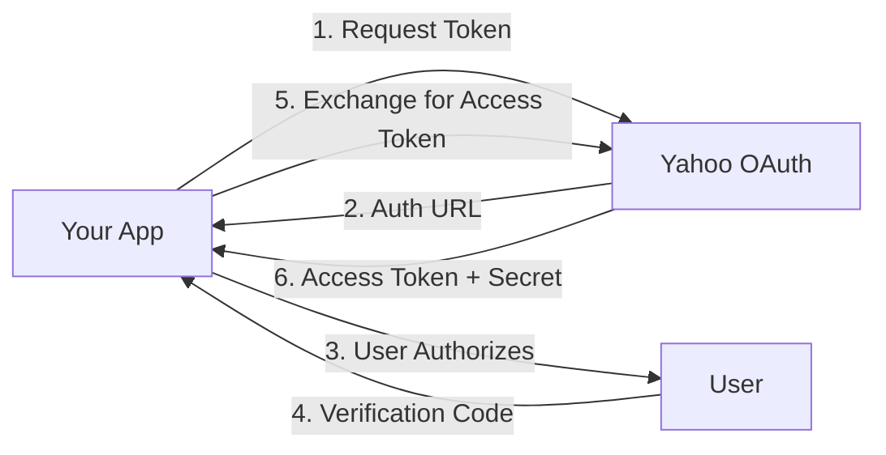

# Yahoo Fantasy MCP Server

A comprehensive Model Context Protocol (MCP) server providing full access to the Yahoo Fantasy Sports API. This server enables AI assistants and applications to interact with Yahoo Fantasy Football, Baseball, Basketball, and Hockey leagues through a well-typed, secure interface.

[](https://www.typescriptlang.org/)
[](https://modelcontextprotocol.io/)
[](LICENSE)

## 🌟 Features

- **54 MCP Tools**: Complete coverage of Yahoo Fantasy Sports API
- **OAuth 1.0a Authentication**: Secure authentication with automatic token refresh
- **Full TypeScript Support**: Comprehensive type definitions for all endpoints
- **MCP Protocol Compliant**: Standard implementation for seamless AI assistant integration
- **Multiple Transport Modes**: stdio (local) and HTTP/SSE (remote) support
- **Session-Free Operation**: Use with or without session IDs - your choice! ✨
- **Intelligent Error Handling**: Specialized error types for roster locks, auth failures, and permissions ✨
- **n8n Integration**: Works with n8n MCP Client for workflow automation
- **Multi-Sport Support**: NFL, MLB, NBA, and NHL fantasy leagues
- **Transaction Management**: Add/drop players, trades, waivers, and FAAB bidding
- **Commissioner Tools**: League settings, roster management, transaction processing
- **Real-time Data**: Live scores, standings, matchups, and player statistics
- **Advanced Features**: Draft results, player ownership, trade voting, and more

## 🎯 Quick Start Modes

### Mode 1: Direct HTTP (No Session Required) ✨ NEW!

The simplest way to use the MCP server - just POST requests, no session management:

```bash
# Start the server
bun run dev

# Send a request (no session ID needed!)
curl -X POST http://localhost:3000/mcp/message \
  -H "Content-Type: application/json" \
  -d '{"jsonrpc":"2.0","id":1,"method":"tools/list","params":{}}'
```

Perfect for:
- Testing and prototyping
- Simple integrations
- Stateless applications
- Any HTTP client

[See full Direct HTTP guide →](SSE_USAGE.md)

### Mode 2: Server-Sent Events (SSE)

For real-time streaming and bidirectional communication:

```bash
# Connect to SSE endpoint
GET http://localhost:3000/mcp

# Use session ID for streaming responses
POST http://localhost:3000/mcp/message
X-Session-Id: <session-id>
```

Perfect for:
- Real-time applications
- n8n workflows
- Long-running connections
- Server-initiated notifications

[See full SSE guide →](SSE_USAGE.md)

## 📋 Table of Contents

- [Installation](#installation)
- [Quick Start](#quick-start)
- [Authentication Setup](#authentication-setup)
- [Integration Options](#integration-options)
  - [n8n Integration](#n8n-integration)
  - [Cursor/Claude Desktop](#cursorclaude-desktop)
  - [Direct HTTP/API](#direct-httpapi)
- [Usage Examples](#usage-examples)
- [API Reference](#api-reference)
- [Available Tools](#available-tools)
- [TypeScript Types](#typescript-types)
- [Error Handling](#error-handling)
- [Development](#development)
- [Troubleshooting](#troubleshooting)

## 🚀 Installation

### Prerequisites

- [Bun](https://bun.sh/) >= 1.0.0 (faster alternative to Node.js)
- Yahoo Developer Account

### Install Bun

```bash
# macOS/Linux
curl -fsSL https://bun.sh/install | bash

# Windows (WSL)
curl -fsSL https://bun.sh/install | bash

# Or use npm
npm install -g bun
```

### Install Dependencies

```bash
# Clone the repository
git clone <repository-url>
cd yahooMcp

# Install dependencies
bun install
```

### 📦 Build Options

The server can be built in multiple ways depending on your deployment needs:

#### Option 1: Bundled JS (Recommended) - 145 KB
Best for cloud deployments and systems with Bun installed:
```bash
bun run build:bundle   # Creates dist/index.js
bun dist/index.js      # Run the server
```

#### Option 2: Standalone Executable - 55 MB
For systems without Bun (includes full runtime):
```bash
bun run build          # Creates yahoo-mcp executable
./yahoo-mcp            # Run directly
```

#### Option 3: Development Mode
For local development (no build needed):
```bash
bun run dev            # Run directly from source
```

**Size Comparison:**
- Source files: 164 KB
- Bundled JS: 145 KB
- Compiled binary: 55 MB (includes Bun runtime)

**Recommendation**: Use `build:bundle` for Railway/cloud deployments (397x smaller!)

See [BUILD_OPTIONS.md](BUILD_OPTIONS.md) for detailed comparison and use cases.

## ⚡ Quick Start

### 1. Create Yahoo Developer Application

1. Visit [Yahoo Developer Network](https://developer.yahoo.com/)
2. Sign in with your Yahoo account
3. Click **"Create an App"**
4. Fill in the application details:
   - **Application Name**: Your app name
   - **Application Type**: Web Application
   - **Permissions**: Fantasy Sports (Read/Write)
5. Save your **Consumer Key** and **Consumer Secret**

### 2. Configure Environment Variables

Create a `.env` file:

```bash
cp env.example .env
```

Edit `.env`:

```bash
# Required: From Yahoo Developer Console
YAHOO_CONSUMER_KEY=your_consumer_key_here
YAHOO_CONSUMER_SECRET=your_consumer_secret_here

# Optional: OAuth callback URL
# For Railway: https://yahoo-mcp-production.up.railway.app/oauth/callback
# For local: http://localhost:3000/oauth/callback
OAUTH_CALLBACK_URL=http://localhost:3000/oauth/callback

# Optional: Will be auto-generated during OAuth flow
YAHOO_ACCESS_TOKEN=
YAHOO_ACCESS_TOKEN_SECRET=
YAHOO_SESSION_HANDLE=
```

**Important:** In your Yahoo Developer App, set the **Redirect URI** to match your `OAUTH_CALLBACK_URL`:
- Local: `http://localhost:3000/oauth/callback`
- Railway: `https://yahoo-mcp-production.up.railway.app/oauth/callback`

### 3. Authenticate with Yahoo

```bash
bun start
```

The server will start with both HTTP and MCP interfaces:

1. Open your browser to `http://localhost:3000`
2. Click **"Authenticate with Yahoo"**
3. Sign in to Yahoo and authorize the application
4. You'll be automatically redirected back
5. Tokens are saved to `.oauth-tokens.json` (auto-loaded on restart)

### 4. Start Using the MCP Server

Once authenticated, restart the server:

```bash
bun start
```

The server runs in dual mode:
- **HTTP Server** (port 3000): OAuth management, health checks, and MCP endpoints
- **MCP Protocol**: Available via both stdio (local) and HTTP/SSE (remote)

## 🔌 Integration Options

The Yahoo Fantasy MCP Server supports multiple integration methods. Choose the one that fits your use case:

### n8n Integration

Perfect for **workflow automation** and **scheduled tasks**.

**Quick Setup:**
1. Deploy to Railway or run locally
2. Authenticate via web UI
3. Add MCP Client node in n8n
4. Set Server URL to `https://your-server.com/mcp`

**Use Cases:**
- Automated waiver wire pickups
- Weekly standings reports
- Trade analysis and alerts
- Lineup optimization

📖 **Full Guide**: [N8N_SETUP.md](N8N_SETUP.md)

### Cursor/Claude Desktop

Perfect for **local development** and **AI-assisted coding**.

**Quick Setup:**
1. Run locally with `USE_STDIO=true`
2. Configure in Cursor/Claude Desktop settings
3. Access via AI chat interface

**Use Cases:**
- Interactive league management
- Data analysis and queries
- Development and testing
- AI-assisted fantasy decisions

📖 **Full Guide**: [INTEGRATION_GUIDE.md](INTEGRATION_GUIDE.md#cursorclaude-desktop-integration)

### Direct HTTP/API

Perfect for **custom applications** and **web integrations**.

**Quick Setup:**
1. Deploy server to Railway/Heroku
2. Make JSON-RPC requests to `/mcp/message`
3. Use standard HTTP clients (curl, fetch, axios, etc.)

**Use Cases:**
- Custom web applications
- Mobile apps
- Slack/Discord bots
- Data analysis tools

📖 **Full Guide**: [INTEGRATION_GUIDE.md](INTEGRATION_GUIDE.md#direct-http-integration)

## 🔐 Authentication Setup

### Understanding OAuth 1.0a Flow

Yahoo Fantasy uses OAuth 1.0a with three-legged authentication:



### Manual Token Generation

If you prefer to generate tokens manually:

```typescript
import { YahooOAuthClient } from './src/oauth/oauth-client';

const oauthClient = new YahooOAuthClient({
  consumerKey: process.env.YAHOO_CONSUMER_KEY!,
  consumerSecret: process.env.YAHOO_CONSUMER_SECRET!
});

// 1. Get request token
const requestToken = await oauthClient.getRequestToken();
console.log('Visit:', requestToken.authorizeUrl);

// 2. User authorizes and you get verification code

// 3. Exchange for access token
const accessToken = await oauthClient.getAccessToken(
  requestToken.token,
  requestToken.secret,
  verificationCode
);

console.log('Access Token:', accessToken.oauth_token);
console.log('Access Secret:', accessToken.oauth_token_secret);
console.log('Session Handle:', accessToken.oauth_session_handle);
```

### Token Refresh

Tokens can be refreshed using the session handle:

```typescript
await oauthClient.refreshAccessToken(sessionHandle);
```

## 📚 Usage Examples

### Basic League Information

```typescript
// Get user's leagues for current NFL season
{
  "tool": "get_user_leagues",
  "arguments": {
    "gameKey": "nfl"
  }
}

// Get detailed league information
{
  "tool": "get_league",
  "arguments": {
    "leagueKey": "423.l.123456"
  }
}

// Get league standings
{
  "tool": "get_league_standings",
  "arguments": {
    "leagueKey": "423.l.123456"
  }
}
```

### Player Management

```typescript
// Search for players
{
  "tool": "search_players",
  "arguments": {
    "gameKey": "nfl",
    "filters": {
      "search": "mahomes",
      "position": "QB",
      "count": 10
    }
  }
}

// Get player statistics
{
  "tool": "get_player_stats",
  "arguments": {
    "playerKey": "423.p.31023",
    "statType": "season",
    "season": "2024"
  }
}

// Get free agents
{
  "tool": "get_free_agents",
  "arguments": {
    "leagueKey": "423.l.123456",
    "position": "WR",
    "count": 25
  }
}
```

### Transactions

```typescript
// Add a player (Free Agent)
{
  "tool": "add_player",
  "arguments": {
    "leagueKey": "423.l.123456",
    "teamKey": "423.l.123456.t.1",
    "playerKey": "423.p.31023"
  }
}

// Add/Drop with FAAB bid
{
  "tool": "add_drop_players",
  "arguments": {
    "leagueKey": "423.l.123456",
    "teamKey": "423.l.123456.t.1",
    "addPlayerKey": "423.p.31023",
    "dropPlayerKey": "423.p.28389",
    "faabBid": 15
  }
}

// Propose a trade
{
  "tool": "propose_trade",
  "arguments": {
    "leagueKey": "423.l.123456",
    "traderTeamKey": "423.l.123456.t.1",
    "tradeeTeamKey": "423.l.123456.t.2",
    "players": [
      {
        "playerKey": "423.p.31023",
        "sourceTeamKey": "423.l.123456.t.1",
        "destinationTeamKey": "423.l.123456.t.2"
      },
      {
        "playerKey": "423.p.28389",
        "sourceTeamKey": "423.l.123456.t.2",
        "destinationTeamKey": "423.l.123456.t.1"
      }
    ],
    "tradeNote": "Let's make a deal!"
  }
}
```

### Advanced Transaction Management

```typescript
// Accept a pending trade
{
  "tool": "accept_trade",
  "arguments": {
    "leagueKey": "423.l.123456",
    "transactionKey": "423.l.123456.tr.2",
    "tradeNote": "Sounds good!"
  }
}

// Edit waiver claim
{
  "tool": "edit_waiver_claim",
  "arguments": {
    "leagueKey": "423.l.123456",
    "transactionKey": "423.l.123456.w.1",
    "faabBid": 25,
    "priority": 1
  }
}

// Vote on trade (league voting enabled)
{
  "tool": "vote_on_trade",
  "arguments": {
    "leagueKey": "423.l.123456",
    "transactionKey": "423.l.123456.tr.3",
    "vote": "allow"
  }
}
```

### Commissioner Tools

```typescript
// Edit league settings (Commissioner only)
{
  "tool": "edit_league_settings",
  "arguments": {
    "leagueKey": "423.l.123456",
    "settings": {
      "waiverType": "continual",
      "tradeEndDate": "2024-11-15",
      "tradeRejectTime": "2"
    }
  }
}

// Manage roster for another team (Commissioner only)
{
  "tool": "manage_roster",
  "arguments": {
    "leagueKey": "423.l.123456",
    "teamKey": "423.l.123456.t.5",
    "action": "add_drop",
    "addPlayerKey": "423.p.31023",
    "dropPlayerKey": "423.p.28389"
  }
}

// Process pending transaction (Commissioner only)
{
  "tool": "process_transaction",
  "arguments": {
    "leagueKey": "423.l.123456",
    "transactionKey": "423.l.123456.tr.4",
    "action": "approve",
    "note": "Trade approved by commissioner"
  }
}
```

### Matchups and Scoring

```typescript
// Get detailed matchup information
{
  "tool": "get_matchup_details",
  "arguments": {
    "leagueKey": "423.l.123456",
    "week": "5"
  }
}

// Get team statistics
{
  "tool": "get_team_stats",
  "arguments": {
    "teamKey": "423.l.123456.t.1",
    "statType": "week",
    "week": "5"
  }
}
```

## 🛠️ Available Tools

### User & Game Management (9 tools)
- `get_user_games` - Get user's fantasy games
- `get_user_leagues` - Get user's leagues for a specific game
- `get_user_profile` - Get user profile information
- `get_user_teams` - Get all teams for a user
- `get_league_history` - Get historical league data from past seasons
- `get_team_history` - Get historical team performance data
- `get_game_info` - Get detailed game information
- `get_game_metadata` - Get game metadata and settings
- `get_game_stat_categories` - Get stat categories for a game

### League Management (16 tools)
- `get_league` - Get detailed league information
- `get_league_settings` - Get league settings and configuration
- `get_league_metadata` - Get league metadata
- `get_league_rosters` - Get all team rosters in league
- `get_league_standings` - Get league standings
- `get_league_teams` - Get all teams in a league
- `get_league_scoreboard` - Get league scoreboard/matchups
- `get_matchup_details` - Get detailed matchup information
- `get_league_stats` - Get league-wide statistics
- `get_live_scores` - Get live scoring updates
- `get_game_updates` - Get real-time game updates
- `get_league_transactions` - Get league transactions
- `get_league_players` - Get all players in a league
- `get_draft_results` - Get draft results
- `get_draft_teams` - Get draft team information
- `get_draft_settings` - Get draft settings

### Team Management (6 tools)
- `get_team` - Get detailed team information
- `get_team_roster` - Get team roster
- `get_team_matchups` - Get team matchups
- `get_team_transactions` - Get team transactions
- `get_team_stats` - Get team statistics
- `get_team_context` - Get comprehensive team context for AI agents

### Player Management (8 tools)
- `get_player` - Get detailed player information
- `get_player_stats` - Get player statistics
- `get_player_ownership` - Get player ownership info
- `get_player_notes` - Get Yahoo editorial notes
- `get_free_agents` - Get available free agents
- `search_players` - Search for players by name/position
- `search_players_by_position` - Advanced player search
- `get_injured_reserve` - Get players on IR

### Transactions (8 tools)
- `add_player` - Add a player to your team
- `drop_player` - Drop a player from your team
- `add_drop_players` - Add and drop in one transaction
- `propose_trade` - Propose a trade
- `accept_trade` - Accept a pending trade
- `reject_trade` - Reject a pending trade
- `cancel_trade` - Cancel a trade proposal
- `vote_on_trade` - Vote on a trade

### Waiver Management (3 tools)
- `get_waiver_claims` - Get pending waiver claims
- `edit_waiver_claim` - Edit pending waiver claim
- `cancel_waiver_claim` - Cancel waiver claim

### Commissioner Tools (4 tools)
- `edit_league_settings` - Edit league settings
- `manage_roster` - Manage team rosters
- `process_transaction` - Process pending transactions
- `edit_team_roster` - Edit team roster positions

**Total: 54 MCP Tools**

## 📖 TypeScript Types

### Key Interfaces

```typescript
// League
interface League {
  league_key: string;
  league_id: string;
  name: string;
  scoring_type: string;
  current_week?: string;
  teams?: Team[];
  standings?: Standing[];
}

// Team
interface Team {
  team_key: string;
  team_id: string;
  name: string;
  managers?: Manager[];
  roster?: Player[];
  stats?: Stats;
}

// Player
interface Player {
  player_key: string;
  player_id: string;
  name: {
    full: string;
    first: string;
    last: string;
  };
  display_position: string;
  eligible_positions?: string[];
  player_stats?: PlayerStats;
}

// Transaction
interface Transaction {
  transaction_key: string;
  transaction_id: string;
  type: 'add' | 'drop' | 'add/drop' | 'trade' | 'waiver';
  status: string;
  players?: TransactionPlayer[];
  faab_bid?: string;
}
```

### Tool Input Types

```typescript
// League Filters
interface LeagueFilters {
  game_keys?: string[];
  league_keys?: string[];
  team_keys?: string[];
  standings?: boolean;
  rosters?: boolean;
  matchups?: boolean;
}

// Player Filters
interface PlayerFilters {
  position?: string;
  status?: string;
  search?: string;
  count?: number;
  start?: number;
}

// OAuth Credentials
interface OAuthCredentials {
  consumerKey: string;
  consumerSecret: string;
  accessToken?: string;
  accessTokenSecret?: string;
  sessionHandle?: string;
}
```

## 🔑 Key Formats

Yahoo Fantasy uses specific key formats to identify resources:

| Resource | Format | Example |
|----------|--------|---------|
| Game Key | `{sport}` or `{game_id}` | `nfl` or `423` |
| League Key | `{game_id}.l.{league_id}` | `423.l.123456` |
| Team Key | `{game_id}.l.{league_id}.t.{team_id}` | `423.l.123456.t.1` |
| Player Key | `{game_id}.p.{player_id}` | `423.p.31023` |
| Transaction Key | `{game_id}.l.{league_id}.tr.{transaction_id}` | `423.l.123456.tr.2` |

### Game IDs by Sport

| Sport | Game Key | Example Game ID (2024-2025) |
|-------|----------|------------------------------|
| NFL | `nfl` | `449` (2024 season) |
| MLB | `mlb` | `448` (2025 season) |
| NBA | `nba` | `450` (2024-2025 season) |
| NHL | `nhl` | `451` (2024-2025 season) |

**Note:** Game IDs change each season. Use `get_user_games` or `get_user_leagues` with the sport key (e.g., `"nfl"`) to automatically get the current season's data. Specific game IDs are only needed for accessing historical data.

## ⚠️ Error Handling

The server provides **intelligent error handling** with specialized error types and structured error data. ✨

### Specialized Error Types

The server now detects and provides detailed information for common failure scenarios:

#### 🔒 Roster Lock Errors
When attempting to modify rosters during lock periods (e.g., during active games):

```json
{
  "error_type": "ROSTER_LOCKED",
  "message": "You cannot make changes to your roster for this date.",
  "date": "2025-10-11",
  "team_key": "465.l.27830.t.10",
  "recovery_suggestion": "Try a future date or wait until the lock period ends."
}
```

**Recovery:** Retry with a future date or wait for the roster to unlock after games complete.

#### 🔑 Authentication Errors
When access tokens expire or are invalid:

```json
{
  "error_type": "AUTHENTICATION_FAILED",
  "message": "Authentication failed. Please re-authenticate.",
  "recovery_suggestion": "Use OAuth flow to get a new access token."
}
```

**Recovery:** Re-authenticate using the OAuth flow to obtain fresh tokens.

#### 🚫 Permission Errors
When attempting actions without required permissions:

```json
{
  "error_type": "INSUFFICIENT_PERMISSIONS",
  "message": "This action requires commissioner privileges.",
  "recovery_suggestion": "Use a commissioner account or request appropriate permissions."
}
```

**Recovery:** Use an account with the necessary permissions (e.g., league commissioner).

### Error Handling Example

```typescript
try {
  await fantasyTools.executeTool('edit_team_roster', {
    teamKey: '465.l.27830.t.10',
    playerChanges: [{ playerKey: '465.p.6752', position: 'RW' }],
    date: '2025-10-11'
  });
} catch (error) {
  if (error.message.includes('ROSTER_LOCKED')) {
    // Parse structured error data
    const errorData = JSON.parse(error.message.match(/Structured error data:\n([\s\S]+)$/)[1]);
    console.log('Locked date:', errorData.date);
    // Retry with next day
    const nextDay = addDays(errorData.date, 1);
    // Retry...
  } else if (error.message.includes('AUTHENTICATION_FAILED')) {
    // Re-authenticate
    await reAuthenticate();
  } else if (error.message.includes('INSUFFICIENT_PERMISSIONS')) {
    // Switch to admin account or notify user
    console.log('Requires commissioner privileges');
  }
}
```

**📖 See the [Error Handling Guide](ERROR_HANDLING.md) for complete documentation, including:**
- Detailed error type reference
- Recovery strategies for each error type
- Sport-specific roster lock timing
- Automatic retry examples
- AI agent integration patterns

### Common Error Scenarios

| Error Type | HTTP Status | Cause | Solution |
|------------|-------------|-------|----------|
| `ROSTER_LOCKED` | 400 | Roster changes during lock period | Try future date or wait for unlock |
| `AUTHENTICATION_FAILED` | 401 | Expired/invalid token | Re-authenticate via OAuth |
| `INSUFFICIENT_PERMISSIONS` | 403 | Missing required permissions | Use account with proper access |
| `HTTP_404` | 404 | Invalid key/resource | Verify resource keys are correct |
| `HTTP_429` | 429 | Rate limit exceeded | Implement request throttling |

## 🏗️ Development

### Project Structure

```
yahooMcp/
├── src/
│   ├── api/                    # Yahoo Fantasy API client
│   │   └── yahoo-fantasy-client.ts
│   ├── oauth/                  # OAuth 1.0a implementation
│   │   └── oauth-client.ts
│   ├── tools/                  # MCP tool definitions
│   │   └── fantasy-tools.ts
│   ├── server/                 # MCP server implementation
│   │   └── mcp-server.ts
│   ├── types/                  # TypeScript type definitions
│   │   └── index.ts
│   ├── utils/                  # Utility functions
│   │   └── oauth-helper.ts
│   └── index.ts                # Main entry point
├── dist/                       # Compiled JavaScript (generated)
├── MISSING_FEATURES.md         # Feature tracking
└── README.md                   # This file
```

### Building & Running

```bash
# Development mode (with auto-reload)
bun run dev

# Production mode
bun start

# Run linter
bun run lint

# Run tests
bun test
```

**Note:** With Bun, you don't need a build step! Bun runs TypeScript natively.

### Environment Variables

| Variable | Required | Description |
|----------|----------|-------------|
| `YAHOO_CONSUMER_KEY` | ✅ Yes | From Yahoo Developer Console |
| `YAHOO_CONSUMER_SECRET` | ✅ Yes | From Yahoo Developer Console |
| `OAUTH_CALLBACK_URL` | ⚠️ Recommended | OAuth redirect URI (default: `http://localhost:3000/oauth/callback`) |
| `PORT` | ❌ No | HTTP server port (default: 3000) |
| `HTTP_MODE` | ❌ No | Set to `true` to run HTTP-only (no MCP) |
| `USE_STDIO` | ❌ No | Set to `true` for stdio transport (for Cursor/Claude Desktop) |
| `YAHOO_ACCESS_TOKEN` | ❌ No | Auto-generated during OAuth |
| `YAHOO_ACCESS_TOKEN_SECRET` | ❌ No | Auto-generated during OAuth |
| `YAHOO_SESSION_HANDLE` | ❌ No | Auto-generated during OAuth |

## 🐛 Troubleshooting

### "Authentication failed" Error

**Solution**: Refresh your access token or re-authenticate:

```bash
# Delete old tokens
unset YAHOO_ACCESS_TOKEN
unset YAHOO_ACCESS_TOKEN_SECRET
unset YAHOO_SESSION_HANDLE

# Restart server to re-authenticate
npm start
```

### "Invalid league key" Error

**Solution**: Verify the league key format is correct:

```bash
# Correct format: {game_id}.l.{league_id}
# Example: 423.l.123456

# Get your leagues to find the correct key
{
  "tool": "get_user_leagues",
  "arguments": { "gameKey": "nfl" }
}
```

### "Permission denied" for Commissioner Tools

**Solution**: Commissioner tools only work if you are the league commissioner. Verify:

1. You are logged in as the commissioner
2. The league allows commissioner actions
3. The tool is marked as "commissioner only"

### OAuth Token Expires Quickly

**Solution**: Use session handle to refresh:

```typescript
// Save session handle from initial authentication
const sessionHandle = accessToken.oauth_session_handle;

// Refresh when needed
await oauthClient.refreshAccessToken(sessionHandle);
```

## 📚 Resources

### Documentation
- [Quick Start Guide](QUICKSTART.md) - Get started in 5 minutes
- [n8n Setup Guide](N8N_SETUP.md) - Workflow automation with n8n
- [Integration Guide](INTEGRATION_GUIDE.md) - All integration options
- [API Documentation](API_DOCUMENTATION.md) - Complete tool reference
- [Error Handling Guide](ERROR_HANDLING.md) - Handle roster locks, auth errors, and more ✨

### External Links
- [Yahoo Fantasy Sports API](https://developer.yahoo.com/fantasysports/guide/)
- [Model Context Protocol](https://modelcontextprotocol.io/)
- [n8n Documentation](https://docs.n8n.io/)
- [Bun Documentation](https://bun.sh/docs)

## 🤝 Contributing

Contributions are welcome! Please:

1. Fork the repository
2. Create a feature branch (`git checkout -b feature/amazing-feature`)
3. Commit your changes (`git commit -m 'Add amazing feature'`)
4. Push to the branch (`git push origin feature/amazing-feature`)
5. Open a Pull Request

### Development Guidelines

- Follow existing code style
- Add TypeScript types for all new code
- Update documentation for new features
- Test OAuth flows thoroughly
- Verify against Yahoo API documentation

## 📄 License

MIT License - see [LICENSE](LICENSE) file for details

## 🙏 Acknowledgments

- Yahoo Fantasy Sports API team
- Model Context Protocol contributors
- TypeScript community

## 📞 Support

For issues and questions:

1. Check the [Troubleshooting](#troubleshooting) section
2. Review [Yahoo Fantasy API Documentation](https://developer.yahoo.com/fantasysports/guide/)
3. Open an issue on GitHub
4. Check server logs for detailed error messages

---

**Made with ❤️ for Fantasy Sports enthusiasts**
